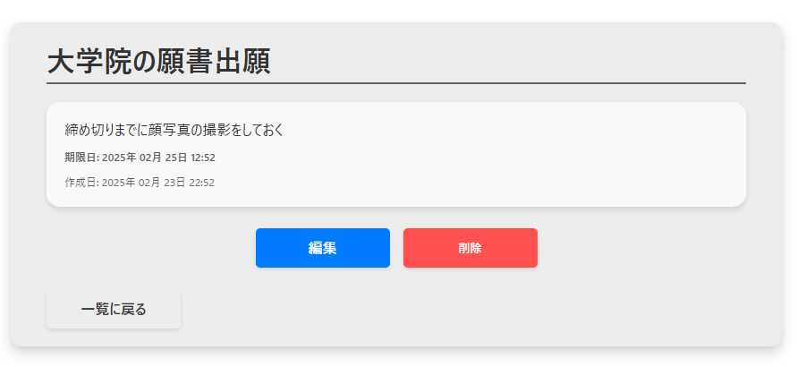

<div id="top"></div>

# 次世代のToDoリストアプリ


## 概要

このアプリは、タスク管理を効率的に行うための次世代のToDoリストアプリです。

- **音声認識**
  - 音声入力で手軽にタスクを追加できます。
- **AIアドバイス**
  - Gemini APIを使用してタスクの優先順位や効率的なこなし方をアドバイスします。
- **Gmail認証**
    - Gmailによる認証が可能です。
- **Gmail連携**
  - Gmailによる認証を行い、タスクに関するリマインダーをGmailで送信できます。
- **タスク管理**
  - タスクの追加、編集、削除、完了状態の切り替えができます。
- **ソート機能**
    - タスクを期限や作成日でソートできます。

## 技術スタック

Dockerで環境構築を行い、バックエンドにFlaskを使用しています。
<br>また、データベースはPostgreSQLを採用し、APIとの連携も行っています。
<br>さらに、SpeechRecognitionによる音声入力を実現しました。

- **Docker**
- **Python & Flask**
- **PostgreSQL**
- **Gemini API**
- **Gmail API**
- **SpeechRecognition**
- SQLAlchemy
- Flask-Migrate
- JavaScript

## 機能

### タスク追加


### 音声認識

音声認識ボタンを押して追加したいタスク名を言うだけで自動でタスクが追加されます。


### 1週間以内ボタン

期限が1週間以内のタスクのみ表示されます。
※期限が過ぎているタスクは表示されません。


### AIアドバイス

AIアドバイスボタンを押すことで、登録されているタスクの情報をGeminiに入力して、優先度の高いタスクを教えてくれます。


### メールでリマインド


### タスクの詳細

タスクをクリックすることでタスクの詳細画面に遷移します。



### タスクの編集


### 並べ替え機能、完了マーク

作成日順、期限日（昇順・降順）でタスクを並べ替えることができます。
<br>また、完了マークにチェックを入れることでタスク名が薄く表示されます。


## 環境構築

1. リポジトリをクローンします。

```sh
git clone [URL]
cd docker-flask-app
```

2. 環境変数を設定します。`./.env`ファイルを作成し、以下の内容を記述します。

    ※Gemini APIキーは各自で取得してください。
    <br>https://aistudio.google.com/apikey

```plaintext
API_PORT=3000
DB_PORT=5432

POSTGRES_USER=your_postgres_user
POSTGRES_PASSWORD=your_postgres_password
POSTGRES_DB=your_postgres_db
POSTGRES_HOST=db
POSTGRES_PORT=5432
YOUR_API_KEY=your_gemini_api_key
```

3. OAuth 2.0 クライアントIDを取得する際に`credentials.json`ファイルをDLし、`./app/credentials.json`ファイルを追加します。

    まず以下のURLにアクセスして、以下の順番で進めてください。
    <br>https://console.cloud.google.com/
    <br>APIとサービス > プロジェクトの作成 > プロジェクト構成を入力し、作成 > OAUTHクライアントを作成 > ウェブアプリケーションを選択 > 承認済みのリダイレクトに`http://localhost:3000/google_callback`を追加し、作成 > クライアントに移動するので、OAuth 2.0 クライアントIDのDLアイコンをクリック > JSONをダウンロード > ファイル名を`credentials.json`に変更し、`./app/credentials.json`に追加
    <br>※この際にGmailを検索し、有効化しておいてください。
    <br>※必要な場合はこのページの対象からテストユーザーを追加します。

4. Dockerコンテナをビルドして起動します。

```sh
docker-compose up --build
```

5. ブラウザで`http://localhost:3000`にアクセスします。

6. テストユーザーの追加

    Google認証をする際にアクセスをブロックされた場合、「対象」からテストユーザーを追加する欄で認証するメアドを追加します。
    <br>※テストメールの送信に失敗する場合はGmail APIが有効化されていない可能性があります。
    <br>その場合は検索欄からgmailと検索し、Gmail APIを有効にしてください。

    
    

7. コードを編集したらCtrl+Cでstopして以下のコマンドを入力してください。

```
docker compose up --build -d
docker compose up
```

## エラーの対処法メモ

1. Docker Desktopを起動
2. とりあえずビルドしてみる
   `docker-compose build --no-cache`
3. Ctrl+Cでstopして再度`docker compose up --build -d` & `docker compose up`
4. ポート番号が3000であることに注意
5. `.env`ファイルに追記する場合は`compose.yml`にも追記
6. compose upした後に別のターミナルで`docker exec -it docker-flask-todo-web-1 sh`
   - #が表示されるので`flask db upgrade`を入力
    <br>もしフォルダの名前がpy-todoなら`docker exec -it py-todo-web-1 sh`のようにコマンドを変更
    <br>compose upした際に名前が表示されるのでそちらを確認


7. `./.env`ファイルと`./app/credentials.json`ファイルを作成したかどうか確認
8. とりあえずAIにエラーメッセージを投げてみる

<p align="right">(<a href="#top">トップへ</a>)</p>